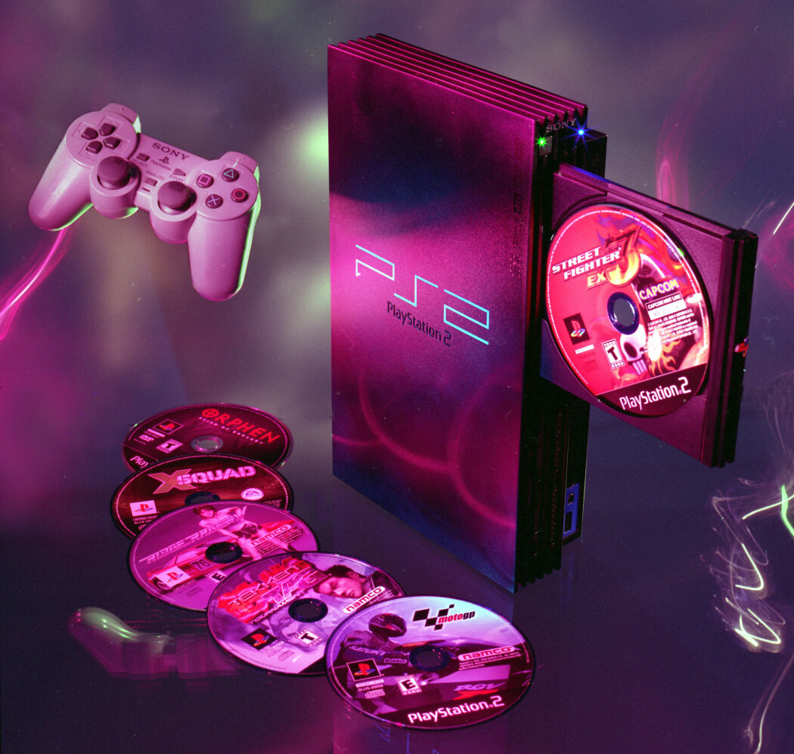

# L'évolution_des_consoles

La plupart des consoles ont des qualités spéciales et uniques. Que ce soit le design, le hardware ou l'expérience qu'elles nous apportent.

## L'Atari 2600

###### Sortie en 1977
###### 40 millions d'unités vendues

###### L'Atari 2600 était la console des années 80 puisque les jeux Pong et Asteroids étaient exclusifs. Ces jeux étaient des favoris des fans.

###### L'Atari est une vieille console donc le hardware n'est pas le meilleur.

###### Le processeur utilisé se nomme MOS Technology 6507 qui exécute à 1.19 MHz

###### Son processeur d'audio et de vidéo se nomme: Television Interface Adaptor

###### La résolution était de 40 x 192 pixels et son maximum était de 160 x 192 pixels

###### Le RAM était placé dans une Chip nommée MOS Technology RIOT et 128 bytes pouvaient être inclus dans les cartouches de jeux.

###### Le ROM avait une capacité de 4 kb

###### Après le déclin du marché de jeux vidéos de 1983, l'Atari perd sa popularité de la companie, qui perdait beaucoup d'argent, a décidé de vendre la companie à Tramiel Technologies.

## Le Nintendo Entertainment System

###### Sortie en 1985
###### Environ 62 millions d'unités vendues

###### La NES est la première console de Nintendo et elle est responsable du revitalisement du jeu vidéo après le crash des jeux vidéos.

###### Son processeur se nomme le Ricoh 2A03. C'est un microprocesseur 8-bit contenant un second source MOS Technology 6502 core fonctionnant à 1.79 MHz.

###### Elle contient 2 KB de RAM

###### La résolution standard de la console est de 256 pixels horizontaux par 240 pixels verticaux.

###### La NES est la septième console de Nintendo la plus vendue.

## La Sega Genesis

###### Sortie en 1989
###### Environ 30,75 millions d'unités vendues

###### Cette console a introduit le personnage de Sonic the hedgehog au monde

###### Le processeur utilisé dans la genesis est un microprocesseur de 16/32 bit. Il se nomme le motorola 68000 CPU et il fonctionne à 7.6 MHz.

###### Un processeur 8-bit Zilog Z80 contrôle le son.

###### Le Genesis a 64 KB de RAM, 64 KB de RAM de vidéo et 8 KB de RAM audio.

###### Il peut afficher jusqu'à 61 couleures immédiatement d'une palette de 512 couleurs.

## Le Gameboy

###### Sortie en 1989
###### Nintendo a vendue 118,69 unités de Game Boy et Game Boy color combinés.

###### Le Gameboy possède une Chip nommée "System On Chip" qui loge la plupart des composantes du système comme le CPU.

###### Le processeur est un Sharp SM83 et c<est un mix entre le Z80 et le Intel 8080.

###### La console fonctionne à 4.19 MHz

###### Nintendo a mis 8 KB de RAM dans le game boy

###### La résolution du game boy est de 160 x 144 pixels et montre 4 nuances de gris. Mais le gameboy original a un problème car il affiche des images vertes.

## La playstation 2

###### Sortie en 2000
###### 158 millions d'unités vendues

###### Le CPU de cette console se nomme Emotion Engine et il fonctionne à environ 294.91 MHz

###### Le GPU de la console est un GPU de 250 nm

###### La Ps2 possède un dvd player

###### Un des meilleurs points forts de la console est la rétrocompatibilité ce qui permettait de jouer à des jeux de Ps1.

###### La PS2, malgré l'excellent branding de Sony qui disait que cette console serait le futur du gaming, n'était pas ce qu'elle présumait d'être. Mais cela n'a pas empêché les joueurs de l'acheter car c'était la meilleure option pour jouer.

## La Xbox 360

###### Sortie en 2005
###### 85,8 millions d'unités vendues

###### Le processeur de la console est un IBM Power Pc-based CPU qui possède trois 3.2 GHz cores.

###### La console possède aussi un un processeur de graphique ATI.

###### Il possède 512 MB 700MHz MHz GDDR3 de RAM

###### Il y avait aussi une possibilité de détacher le hard drive et de le changer 

###### Un lecteur DVD est inclus dans la console

###### Il y avait une possibilité de jouer avec 4 manettes.

